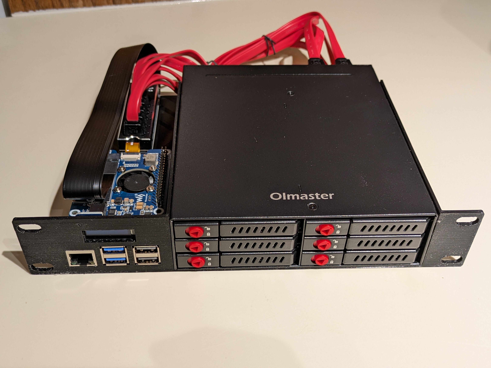

# Mini Rack 1U Pi NAS
A 10" rackmount NAS utilizing the Raspberry Pi 5 and a 5.25" hot swap bay.

## Design
This project was designed in FreeCAD 1.0.2. It is my first ever CAD designed project, so there was a little bit of learning involved. Luckily I measured twice and printed once, so everything turned out to fit fine on the first try. \
\
For my use, the Raspberry Pi 5 is powered from a PoE+ switch. The 5.25" bay hot swap is powered via two molex connections on a different power supply within my mini-rack. \
\
The operating system I am using is OpenMediaVault (OMV), booting from a USB stick. You are free to use your operating system of choice. 

## Picture

## Files
* 1U-Pi-NAS-5.25-bay.FCStd -- main FreeCAD project file
* 1U-Pi-NAS-5.25-bay-Body.stl -- the STL file for 3D printing
* Chieftec CMR-625.stp -- 3D model file of the 5.25" hot swap bay used for modeling
* RaspberryPi5.step -- 3D model file of the Raspberry Pi 5 used for modeling
* PiOLED.STEP -- 3D model file of the OLED used for modeling
* 3Dvid.mp4 -- a short screen capture video of the project to show what it looks like

## Parts Needed
Below is a list of the exact parts I used, but you may substitute for different parts. You may need to edit the CAD model if your chosen parts are different sizes or have different mounting locations. Non-affiliate Amazon links for product reference. Prices may be better elsewhere.
* Raspberry Pi 5 - https://www.microcenter.com/product/673712/raspberry-pi-5
* Waveshare PoE M.2 HAT+ - https://www.amazon.com/dp/B0DGL3KVJT
* Xiwai NGFF M-key NVMe SSD Extender Card - https://www.amazon.com/dp/B0DHVM6CMN
* Riitop M.2 to SATA 6-port Adapter - https://www.amazon.com/dp/B0FJCFH7J3
* Readyxio 6-bay SSD SATA Hot Swap 5.25 - https://www.amazon.com/dp/B0CQT4VQR4
* DIYmall PiOLED 0.91" - https://www.amazon.com/dp/B07V4FRSKK
* 8x M2.5x4mm screws to mount the Pi and NGFF extender
* 1x M3x4mm screw to mount the OLED display
* 6x Male to Female DuPont style jumpers to hook up the OLED display
* Zip ties or wire ties for SATA cable routing

## License
The Unlicense - see license file in this repository. \
\
The files "Chieftec CMR-625.stp", "RaspberryPi5.step", and "PiOLED.STEP" are not my own creation and were only used for 3D modeling dimensions and layout. They were found on GrabCAD and each model shall be attributed to their respective creator. These models as they were used in this project were not modified in any way.
